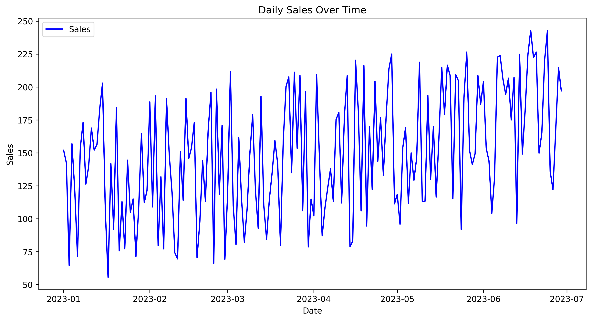
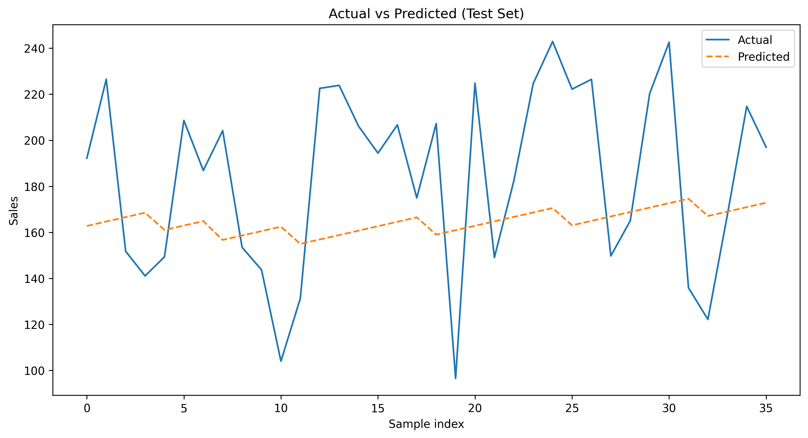
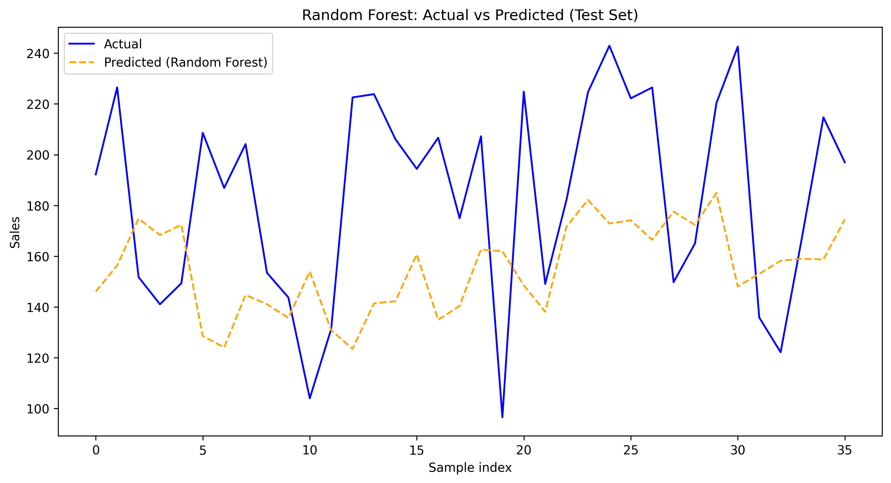
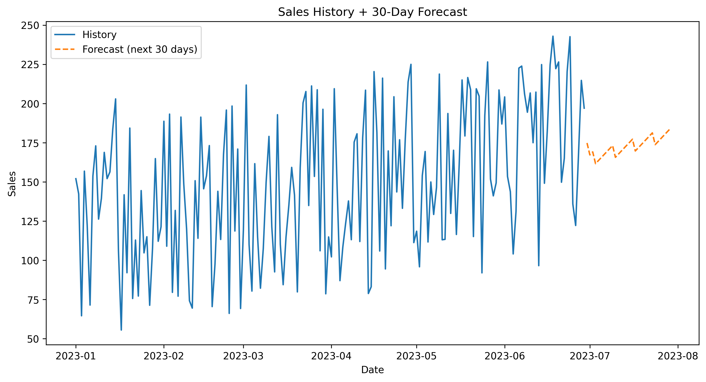

# 📈 Sales Demand Forecasting

This project develops a **regression-based machine learning model** to analyze historical sales data and forecast future demand.  
It uses **Python, Pandas, NumPy, Scikit-learn, and Matplotlib/Seaborn** for data analysis, preprocessing, model training, and visualization.

---

## 🚀 Features
- Generate sample sales data (or use your own CSVs).
- Visualize sales trends over time.
- Train a **Linear Regression model** for forecasting.
- Evaluate model performance (MAE, RMSE).
- Forecast sales for the next **30 days** with visual plots.

---

## 📂 Project Structure
```sales-demand-forecasting/
│
├── data/ # Generated or real sales data
│ └── sales_data.csv
├── sales_forecasting.ipynb # Jupyter Notebook with full workflow
├── .gitignore # Ignore unnecessary files
├── LICENSE # MIT License
└── README.md # Project documentation (this file)
```


---

## ⚙️ Installation & Setup
1. Clone the repository:
   ```bash
   git clone https://github.com/CodeWithSharda/sales-demand-forecasting.git
   cd sales-demand-forecasting

2. Create and activate a virtual environment:
```python -m venv venv
venv\Scripts\activate   # On Windows
source venv/bin/activate  # On Mac/Linux
```
3. Install dependencies:
```
pip install -r requirements.txt
```
## 📊 Usage

Run the Jupyter Notebook:
```
    jupyter notebook
```
Open sales_forecasting.ipynb and execute the cells step by step.

You will see:
* Sales trends plots
* Actual vs Predicted graphs
* A 30-day sales forecast

## 📸 Sample Output

### Sales Trend


### Linear Regression - Actual vs Predicted


### Random Forest – Actual vs Predicted


### 30-Day Forecast


---

## 📊 Model Performance Comparison

| Model               | MAE (Mean Absolute Error) | RMSE (Root Mean Squared Error) |
|----------------------|---------------------------|--------------------------------|
| Linear Regression    | 38.10                     | 43.62                          |
| Random Forest        | 43.94                     | 51.35                          |

**Takeaway**: We compared Linear Regression and Random Forest models; interestingly, Linear Regression achieved lower error on this dataset, demonstrating the importance of testing multiple approaches.

## 🧑‍💻 Tech Stack

* Python 3.x
* Pandas
* NumPy
* Matplotlib
* Seaborn
* Scikit-learn

## 📜 License

This project is licensed under the MIT License

